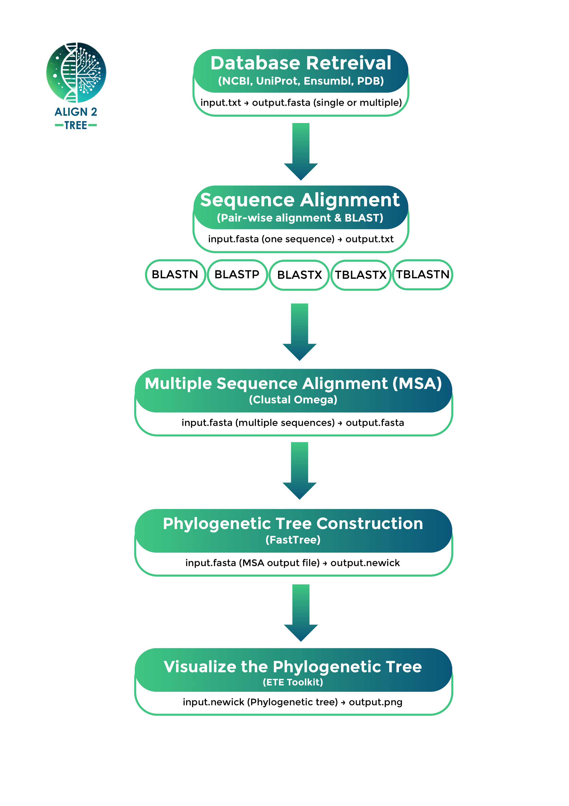

# Align2Tree: Bioinformatics Automation Script
<p align="center">
  <a href="Align2Tree.png">
    
  </a>
</p>

## Overview

Align2Tree is a comprehensive bioinformatics script designed to automate key tasks such as database retrieval, sequence alignment, multiple sequence alignment (MSA), and phylogenetic tree construction. The script provides an easy-to-use interface for researchers to streamline their workflows and generate meaningful insights from biological data.

## Workflow
<p align="center">
  
</p>


## Features

### Database Retrieval:

* Fetch sequences or structures from popular databases like NCBI, UniProt, Ensembl, and PDB.

* Supports retrieval based on accession IDs, with options to save results in a single file or separate files.

### Sequence Alignment:

Perform sequence alignment using BLAST with multiple options:

* blastn: Nucleotide sequence alignment.

* blastp: Protein sequence alignment.

* blastx: Translate nucleotide sequences and align against protein sequences.

* tblastn: Align protein sequences against translated nucleotide sequences.

* tblastx: Translate and align nucleotide sequences.

### Multiple Sequence Alignment (MSA):

* Align multiple sequences using Clustal Omega.

* Generate aligned sequences in FASTA format.

### Phylogenetic Tree Construction:

* Build phylogenetic trees using FastTree.

* Visualize trees as PNG images using Python and the ETE Toolkit.

### Combined Pipeline:

* Automate the entire workflow, including data retrieval, MSA, and phylogenetic tree construction.

### Help Menu:

* Provides detailed guidance on each task and the required tools.

## Prerequisites

### 1. BLAST (Sequence Alignment)
BLAST can be installed using a package manager or downloaded from the NCBI website.

#### Install BLAST

For Linux (Ubuntu):
```bash
sudo apt install -y ncbi-blast+
```

For MacOS:
```bash
brew install blast
```

### 2. Clustal Omega (Multiple Sequence Alignment)

#### Install Clustal Omega

For Linux(Ubuntu):
```bash
sudo apt install -y clustalo
```

For Mac:
```bash
brew install clustal-omega
```

### 3. FastTree (Phylogenetic Tree Construction)

#### Install FastTree

For Linux (Ubuntu):
```bash
sudo apt install -y fasttree
```

For Mac:
```bash
brew install fasttree
```

### 4. Python with Required Libraries (Python Libraries Installation)

#### Install Python3, pip and required Python libraries

For Linux (Ubuntu):
```bash
sudo apt install -y python3 python3-pip
pip3 install ete3 pillow pyqt5 numpy
```

For Mac:
```bash
brew install python
pip3 install ete3 pillow pyqt5 numpy
```

* Ensure you have Homebrew installed for macOS users.

## Installation

#### Clone the repository:
```bash
git clone https://github.com/HossamMoghni/Align2Tree.git
```

#### Navigate to the project directory:
```bash
cd Align2Tree
```

## Input Requirements

* Input files must be in FASTA format (.fasta) unless specified otherwise.

* For database retrieval, provide a text file with one accession ID per line.

## Usage Instructions

* Clone or download the script

* Run the script using the following command:
```bash
./Align2Tree.sh
```

* Follow the on-screen menu options to perform desired tasks.

* Check the output files in the specified locations.

* If an error occurs (e.g., invalid input, sequence not found), the script will display an appropriate error message and allow you to retry.

* Use Option 9 during any step to return to the main menu.

## Menu Options

### Option 1: Database Retrieval

* Fetch data from NCBI, UniProt, Ensembl, or PDB based on accession IDs.

* Specify whether to save all results in a single file or multiple files.

### Option 2: Sequence Alignment

* Perform sequence alignment using BLAST.

* Choose from multiple alignment options based on your data type.

### Option 3: Multiple Sequence Alignment (MSA)

* Align multiple sequences using Clustal Omega.

* Save the aligned sequences in FASTA format.

### Option 4: Phylogenetic Tree Construction

* Build phylogenetic trees using FastTree.

* Visualize the trees as PNG images using Python and the ETE Toolkit.

### Option 5: Exit

* Exit the script.

### Option 6: Combined Pipeline

* Run a complete pipeline that includes data retrieval, MSA, and phylogenetic tree construction.

### Option 7: Help

* Access detailed information about tasks and tools.

## Output Files

* Sequence Alignment (BLAST): .txt
* Multiple Sequence Alignment (Clustal Omega): .fasta
* Phylogenetic Tree: .newick
* Phylogenetic Tree visualizations: .png

## Support

* For issues or feature requests, please contact: helmoghni@nu.edu.eg.

Note: Ensure all required dependencies are installed before running the script. Check outputs for errors or warnings before proceeding to subsequent steps.

